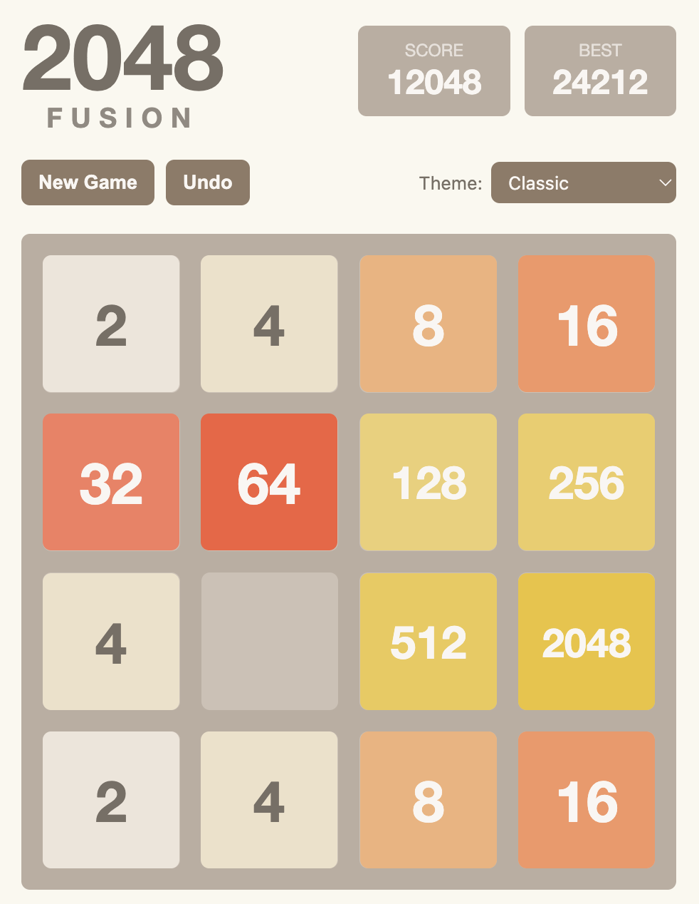
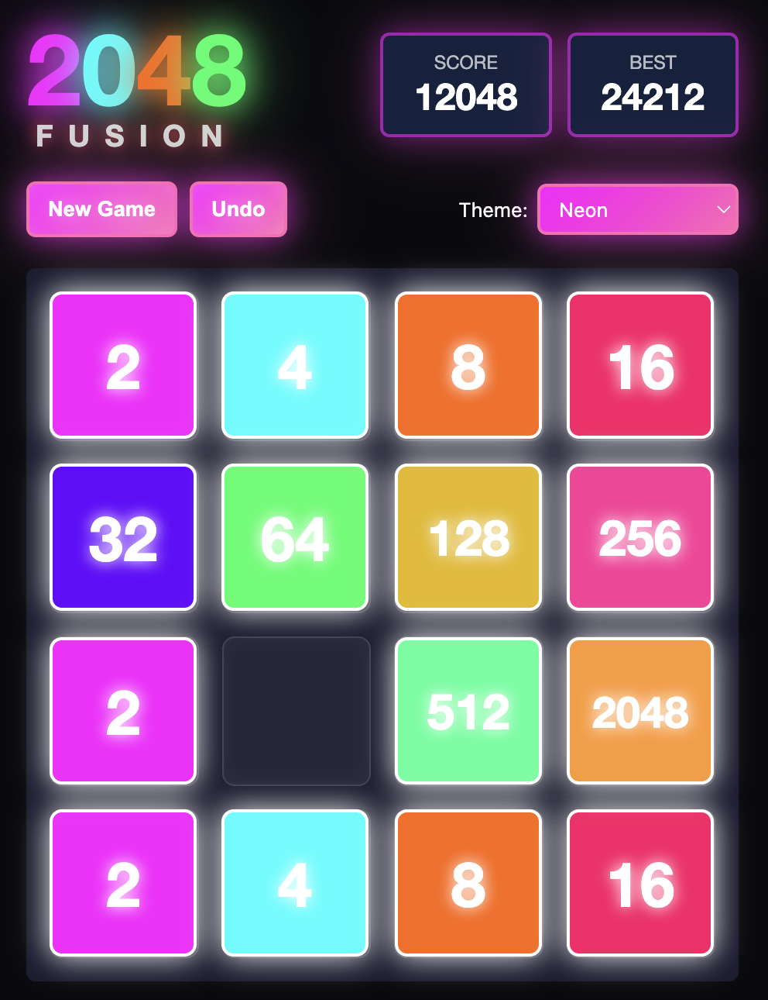
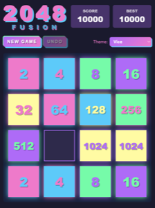
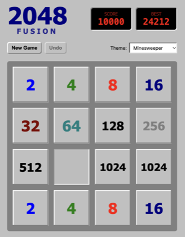
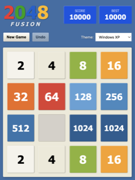
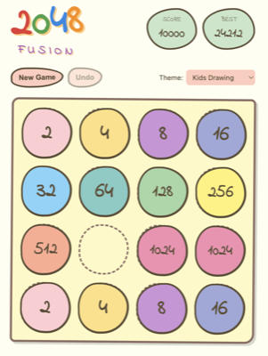
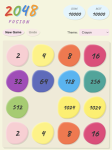
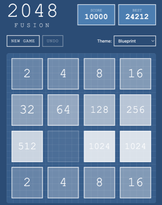
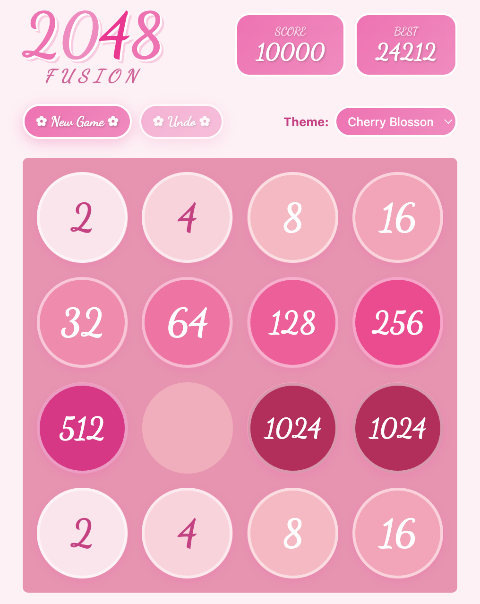

# 2048 Fusion

The classic 2048 puzzle game, reimagined with 18 stunning visual themes.

**[Play Now](https://carlosgsouza.github.io/2048-fusion/)**

## Screenshots

| | | |
|:---:|:---:|:---:|
|  |  |  |
| Classic | Neon | Vice |
|  |  |  |
| Glassmorphism | Aurora | Minesweeper |
|  |  |  |
| Terminal | Game Boy | Windows XP |
|  |  |  |
| Kids Drawing | Crayon | Blueprint |
|  |  |  |
| Whiteboard | Cherry Blossom | Ocean |
|  |  |  |
| Forest | Sunset | Lavender |

## How to Play

Slide tiles in any direction. When two tiles with the same number collide, they merge into one. Reach the 2048 tile to win, then keep going for a higher score.

**Controls:**
- **Arrow keys** or **WASD** - Move tiles
- **Z** or **Ctrl+Z** - Undo (up to 50 moves)
- **Swipe** on mobile

## For Developers

### Run Locally

```bash
git clone https://github.com/carlosgsouza/2048-fusion.git
cd 2048-fusion
open index.html
```

No build step required. Pure HTML, CSS, and TypeScript.

### Debug Mode

Add `?debug=true` to the URL to enable state encoding. Use `?state=<scenario>` to load test scenarios:

```
?state=win      # Near-win state
?state=lose     # Near-lose state
?state=2048     # Two 1024 tiles ready to merge
?state=4096     # Two 2048 tiles ready to merge
```

### Project Structure

```
├── index.html      # Game markup
├── styles.css      # All 18 themes
├── game.ts         # Game logic (TypeScript source)
└── game.js         # Compiled JavaScript
```

## Built With

This project was vibecoded using [Claude Code](https://claude.ai/code).

## License

Open source under the [Apache 2.0 License](LICENSE).
